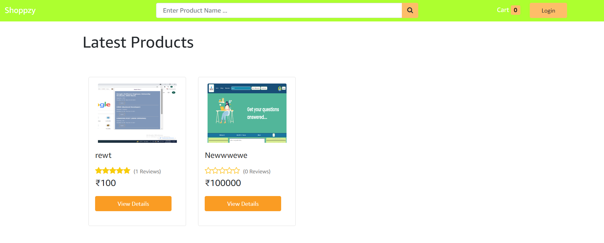
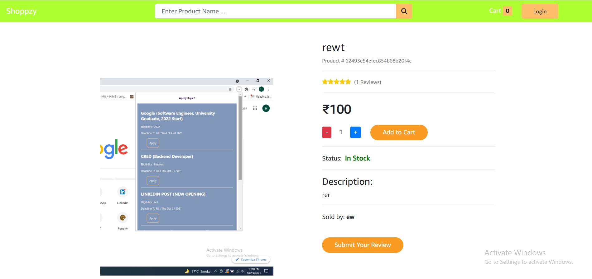
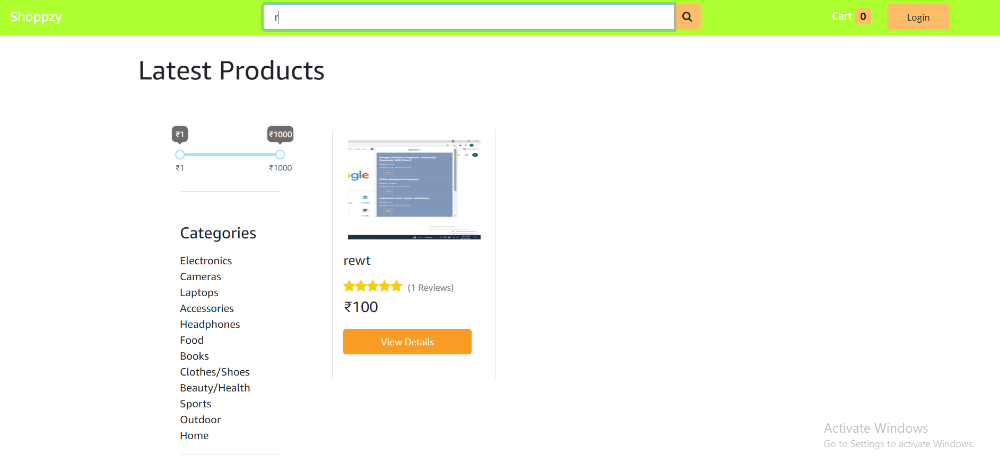
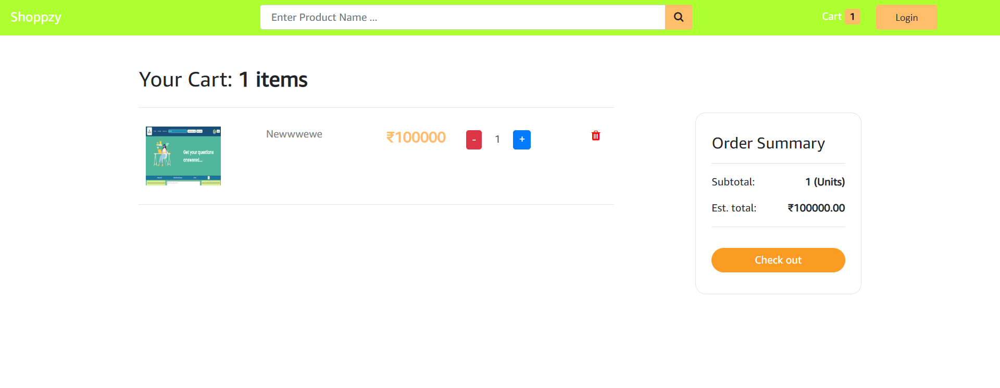
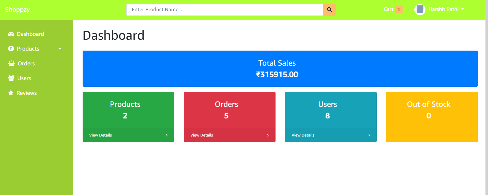
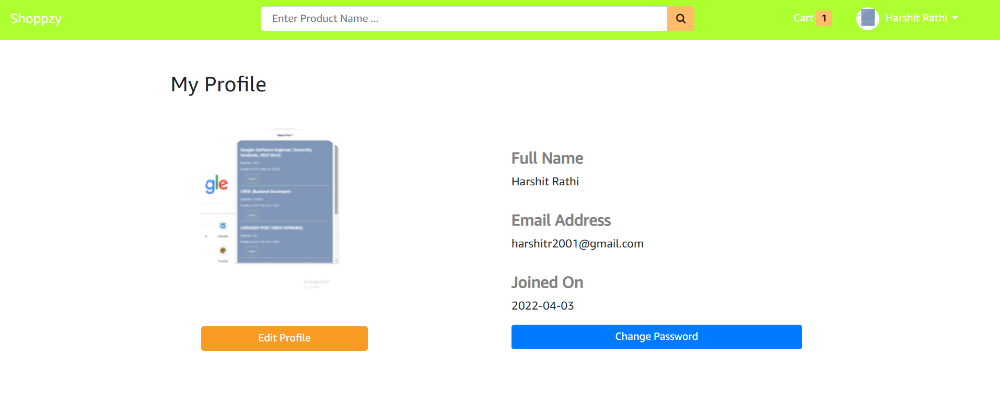

# Shopzzy

An ecommerce website where users can buy products,filter,search,add to cart , and can pay 
through stripe payment.This web app also contains Admin panel which allows the admin to add products,see the sales,manage users and reviews. 

# Tech stacks used:
* React JS
* Redux
* Node JS
* Express JS
* MongoDB
* Stripe

# Screen shots of the Project 

